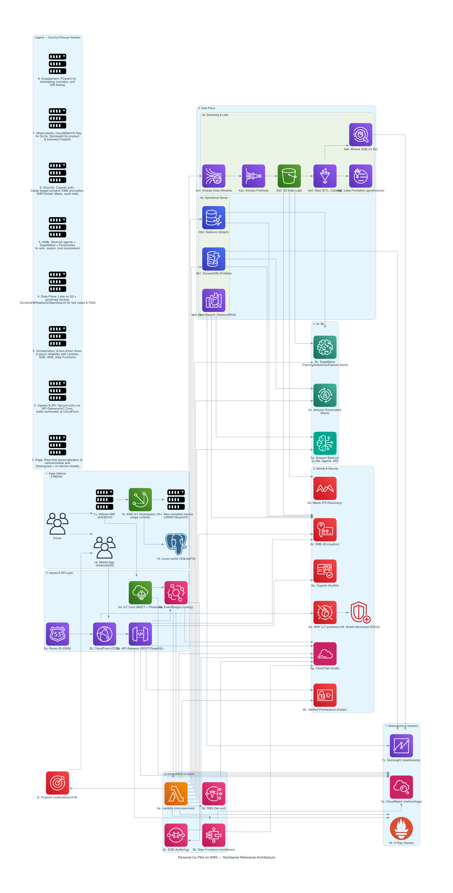

I want to enable you, as an automaker, to deliver a personalized co-pilot experience that scales across millions of drivers while respecting data privacy and regulatory boundaries. The idea is to create a cloud-plus-edge architecture on AWS where each driver has their own evolving profile that captures preferences, habits, and contextual signals. In the cloud, services like Amazon DynamoDB and Amazon Neptune manage high-scale user state and relationship data; Amazon Personalize and SageMaker generate individualized recommendations; and Amazon Bedrock agents provide natural interaction through multimodal AI. At the edge—inside the vehicle runtime or companion app—AWS IoT Greengrass and compact Neo-compiled models deliver low-latency personalization even when offline, synchronizing back to the cloud seamlessly.

This design is deliberately multi-layered: EventBridge + Kinesis capture real-time driver events; S3 + Lake Formation enforce secure, auditable data storage; and Verified Permissions (Cedar policies) manage consent and attribute-level access at scale. With Amazon Location Service, we can tie personalization to geography and context in a privacy-aware way, offering “just-in-time” recommendations for routes, dining, charging, or leisure stops. The result is a platform that feels like a personal concierge—not a generic infotainment system—capable of learning, adapting, and delivering unique value to every driver, all while being built on a robust, cost-optimized, and compliance-ready AWS foundation.

Architecute:
When I describe the architecture, I frame it from the perspective of how the system works end-to-end. I start with the edge, because that’s where the user interacts. In the vehicle or on their mobile device, I deploy lightweight models—compiled with SageMaker Neo—running inside AWS IoT Greengrass. These models act as the driver’s personal co-pilot, providing real-time personalization like remembering preferred cabin settings, suggesting routes, or recommending places of interest, even when offline. The edge components store a short history of interactions locally and synchronize with the cloud whenever connectivity allows, so the driver always has continuity across sessions, vehicles, or devices.

In the cloud, the heavy lifting happens. Every user event flows in through API Gateway or IoT Core, then into EventBridge and Kinesis for streaming ingestion. From there, I maintain durable state in DynamoDB for fast, global-scale access to user profiles, and I enrich these profiles with graph relationships in Neptune and embeddings in OpenSearch Serverless. Machine learning services like Amazon Personalize and SageMaker consume these signals to produce real-time recommendations, while Bedrock and its agents handle natural conversations and contextual reasoning. To protect user trust, Lake Formation enforces data boundaries in S3, Verified Permissions evaluates consent at the attribute level, and KMS ensures everything is encrypted. The result is a layered architecture where the edge delivers instant personalization and the cloud orchestrates intelligence at scale, all built on a cost-optimized, compliant AWS backbone.

Digram:
[](./personal_copilot_aws_architecture_labeled.png)


Now let’s go layer by layer through the architecture and annotate with what it does in this solution.

---

# Detailed Walkthrough of Architecure

---

## **1. Edge (Vehicle & Mobile)**

Where real-time personalization happens closest to the user.

* **1a. Vehicle HMI (AAOS/IVI):**
  The car’s infotainment system or Android Automotive OS interface. It’s the front-end surface where drivers interact with the personal co-pilot.

* **1b. AWS IoT Greengrass v2 (Edge runtime):**
  Runs locally in the vehicle, managing deployment and execution of lightweight models, policies, and data sync jobs. Ensures low-latency personalization even without connectivity.

* **1c. Neo-compiled models (ONNX/TensorRT):**
  Distilled or optimized ML models compiled with SageMaker Neo for fast inference on edge hardware (ARM, x86, GPU). Used for quick ranking, embeddings, or on-device personalization.

* **1d. Local cache (SQLite/FS):**
  Stores recent user interactions, preferences, and embeddings locally. Allows offline continuity and syncs with the cloud once connectivity is restored.

* **1e. Mobile App (Android/iOS):**
  Companion app for continuity outside the vehicle. Acts as another client surface for preferences, recommendations, and notifications.

---

## **2. Ingress & API Layer**

The secure front door to the cloud.

* **2a. Route 53 (DNS):**
  Routes global traffic to the right regional endpoints with latency-based routing.

* **2b. CloudFront (CDN):**
  Provides caching and edge delivery of static content and API endpoints. Improves performance and shields the backend.

* **2c. API Gateway (REST/GraphQL):**
  Unified API layer for mobile apps, vehicle clients, and partners. Can expose REST or GraphQL endpoints. Integrates authentication, throttling, and logging.

* **2d. IoT Core (MQTT + Shadows):**
  Handles bidirectional communication with vehicles. Manages “device shadows” to sync state between car and cloud (e.g., preferred cabin temp).

* **2e. EventBridge (Routing):**
  Central event bus. Ingests driver events and routes them to downstream consumers (Lambda, Kinesis, SQS). Enables decoupled, event-driven architecture.

---

## **3. Orchestration & Async**

Manages workflows and reliability.

* **3a. Lambda (Microservices):**
  Stateless compute layer for request handling, enrichment, and lightweight inference orchestration.

* **3b. Step Functions (Workflows):**
  Coordinates multi-step workflows (e.g., “fetch user profile → call Personalize → call Bedrock → return response”).

* **3c. SQS (Buffering):**
  Queue to absorb traffic spikes and guarantee delivery for asynchronous tasks (e.g., writing to DynamoDB, batch embedding jobs).

* **3d. SNS (Fan-out):**
  Pub/sub messaging for broadcasting events to multiple downstream services (e.g., trigger notifications, update multiple stores).

---

## **4. Data Plane**

The heart of storage and retrieval.

### **4a. Streaming & Lake**

* **4a1. Kinesis Data Streams:**
  High-throughput ingestion of user events (likes, trips, clicks). Feeds both real-time and batch pipelines.
* **4a2. Kinesis Firehose:**
  Pipes streaming data directly into S3 in near real-time.
* **4a3. S3 Data Lake:**
  Durable, low-cost storage of all historical user data, telemetry, and events. Basis for training ML models.
* **4a4. Glue (ETL, Catalog):**
  Manages schema discovery, ETL pipelines, and metadata catalog for the lake.
* **4a5. Lake Formation (Governance):**
  Provides fine-grained access control over S3 data. Ensures compliance and multi-tenant data security.
* **4a6. Athena:**
  Interactive query service for ad-hoc analytics over S3 data.

### **4b. Operational Stores**

* **4b1. DynamoDB (Profiles):**
  Fast, global key-value store for user profiles, preferences, and session data. Single-digit ms latency.
* **4b2. OpenSearch (Vectors/RAG):**
  Vector-enabled search to retrieve embeddings for RAG. Also supports keyword + semantic search on user history.
* **4b3. Neptune (Graph):**
  Graph database modeling relationships (user ↔ places ↔ experiences). Useful for “people like you also liked…” style recommendations.

---

## **5. AI / ML Layer**

Where personalization intelligence happens.

* **5a. Amazon Bedrock (LLMs, Agents, KB):**
  Provides foundation models for natural conversation and contextual reasoning. Agents orchestrate tool calls (e.g., query maps, personalize recs). Knowledge Bases enable RAG over OpenSearch/Neptune.

* **5b. SageMaker (Training/Inference/Feature Store):**
  Custom ML workflows: model training, evaluation, feature engineering. Feature Store keeps real-time personalization features accessible.

* **5c. Amazon Personalize (Recs):**
  Managed recommendation engine for sequence-based personalization (e.g., “next best POI” or “music suggestion”).

---

## **6. Identity & Security**

Guarantees trust, compliance, and governance.

* **6a. Cognito (AuthN):**
  Manages user authentication (social sign-in, MFA, device identity).
* **6b. Verified Permissions (Cedar):**
  Policy engine that enforces consent and fine-grained attribute access (e.g., “only allow marketing use if opted-in”).
* **6c. KMS (Encryption):**
  Key management for encrypting all data at rest.
* **6d. Macie (PII Discovery):**
  Automatically discovers and classifies PII in the data lake.
* **6e. WAF (L7 Protection):**
  Protects APIs and apps from web exploits.
* **6f. Shield Advanced (DDoS):**
  Provides DDoS mitigation at the network/transport layer.
* **6g. CloudTrail (Audit):**
  Full audit logging of all API calls across accounts.

---

## **7. Observability & Analytics**

Ensures visibility and product insights.

* **7a. CloudWatch (Metrics/Logs):**
  Central monitoring of system performance, logs, and alarms.
* **7b. X-Ray (Traces):**
  Distributed tracing to debug latency across services.
* **7c. QuickSight (Dashboards):**
  Visualization layer for product analytics and executive dashboards.

---

## **8. Engagement**

Closing the loop with users.

* **8. Pinpoint (Notifications/A-B):**
  Multi-channel engagement service. Sends push notifications, runs A/B experiments, and orchestrates customer journeys.


---

# CDK Project Structure (example)
CDK helps you deploy this solution and manage it as code. here is the sample example of what this implemnetation will look like.

```
personal-copilot/
├── bin/
│   └── personal-copilot.ts         # CDK app entrypoint
├── lib/
│   ├── api-stack.ts                # API Gateway + Lambda + Cognito
│   ├── data-plane-stack.ts         # DynamoDB, S3, OpenSearch, Neptune
│   ├── ml-stack.ts                 # SageMaker, Personalize, Bedrock integration
│   ├── security-stack.ts           # IAM, KMS, WAF, Shield
│   ├── observability-stack.ts      # CloudWatch, X-Ray, QuickSight (hooks only)
│   └── engagement-stack.ts         # Pinpoint
├── cdk.json
├── package.json
└── tsconfig.json
```

Each `*-stack.ts` corresponds to a logical domain from the architecture diagram.

---

# Sample CDK Snippets (TypeScript)

### 1. API + Auth Layer

```ts
import * as cdk from "aws-cdk-lib";
import * as apigw from "aws-cdk-lib/aws-apigateway";
import * as cognito from "aws-cdk-lib/aws-cognito";
import * as lambda from "aws-cdk-lib/aws-lambda";

export class ApiStack extends cdk.Stack {
  constructor(scope: cdk.App, id: string, props?: cdk.StackProps) {
    super(scope, id, props);

    const userPool = new cognito.UserPool(this, "UserPool", {
      selfSignUpEnabled: true,
      signInAliases: { email: true },
    });

    const fn = new lambda.Function(this, "ProfileLambda", {
      runtime: lambda.Runtime.NODEJS_18_X,
      handler: "index.handler",
      code: lambda.Code.fromInline(`
        exports.handler = async (event) => {
          return { statusCode: 200, body: JSON.stringify({ msg: "Hello from API" }) };
        }
      `),
    });

    new apigw.LambdaRestApi(this, "ApiGateway", {
      handler: fn,
      proxy: true,
      defaultCorsPreflightOptions: { allowOrigins: apigw.Cors.ALL_ORIGINS },
    });
  }
}
```

---

### 2. Data Plane (DynamoDB + S3 + OpenSearch)

```ts
import * as dynamodb from "aws-cdk-lib/aws-dynamodb";
import * as s3 from "aws-cdk-lib/aws-s3";
import * as opensearch from "aws-cdk-lib/aws-opensearchservice";

export class DataPlaneStack extends cdk.Stack {
  constructor(scope: cdk.App, id: string, props?: cdk.StackProps) {
    super(scope, id, props);

    new dynamodb.Table(this, "UserProfileTable", {
      partitionKey: { name: "pk", type: dynamodb.AttributeType.STRING },
      sortKey: { name: "sk", type: dynamodb.AttributeType.STRING },
      billingMode: dynamodb.BillingMode.PAY_PER_REQUEST,
      pointInTimeRecovery: true,
    });

    new s3.Bucket(this, "DataLakeBucket", {
      versioned: true,
      lifecycleRules: [{ expiration: cdk.Duration.days(365) }],
    });

    new opensearch.Domain(this, "VectorSearch", {
      version: opensearch.EngineVersion.OPENSEARCH_2_11,
      capacity: { dataNodes: 2, dataNodeInstanceType: "t3.small.search" },
      nodeToNodeEncryption: true,
      encryptionAtRest: { enabled: true },
    });
  }
}
```

---

### 3. ML & Personalization

```ts
// Bedrock currently doesn’t have a CDK L2 construct.
// You’d configure access via IAM + custom resource.

import * as iam from "aws-cdk-lib/aws-iam";

export class MlStack extends cdk.Stack {
  constructor(scope: cdk.App, id: string, props?: cdk.StackProps) {
    super(scope, id, props);

    new iam.Role(this, "BedrockAccessRole", {
      assumedBy: new iam.ServicePrincipal("lambda.amazonaws.com"),
      managedPolicies: [
        iam.ManagedPolicy.fromAwsManagedPolicyName("AmazonBedrockFullAccess"),
        iam.ManagedPolicy.fromAwsManagedPolicyName("AmazonSageMakerFullAccess"),
      ],
    });

    // For Amazon Personalize, training is often out-of-band, 
    // but you can use CDK to create datasets & event trackers.
  }
}
```

---

### 4. Security

```ts
import * as kms from "aws-cdk-lib/aws-kms";
import * as waf from "aws-cdk-lib/aws-wafv2";

export class SecurityStack extends cdk.Stack {
  constructor(scope: cdk.App, id: string, props?: cdk.StackProps) {
    super(scope, id, props);

    new kms.Key(this, "MasterKey", {
      enableKeyRotation: true,
    });

    new waf.CfnWebACL(this, "WebAcl", {
      defaultAction: { allow: {} },
      scope: "REGIONAL",
      visibilityConfig: {
        cloudWatchMetricsEnabled: true,
        metricName: "waf-metric",
        sampledRequestsEnabled: true,
      },
      rules: [],
    });
  }
}
```

---

# How This Fits Together

* **bin/personal-copilot.ts** → Instantiates `ApiStack`, `DataPlaneStack`, `MlStack`, `SecurityStack`, etc.
* Each stack is modular, deployable independently.
* You can add `Stage` constructs for **dev/test/prod** environments.

## Agile backlog view

Here’s a high-level **Epics** aligned with the architecture, and a set of **User Stories** under each.

---

# Epics & User Stories for *Personal Co-Pilot on AWS*

---

## **Epic 1: Identity & Consent Management**

*As a driver, I need to authenticate securely and control how my data is used so I can trust the system.*

* As a user, I want to sign in using my email or social account so I can access my personal profile.
* As a user, I want to give or revoke consent for specific data uses so I feel in control of my privacy.
* As a system, I must enforce attribute-level permissions so sensitive data is never accessed without consent.
* As an admin, I want to audit user consent changes so I can prove compliance with regulations.

---

## **Epic 2: Edge Personalization (Vehicle & Mobile)**

*As a driver, I want personalized experiences to work in the car and on my phone, even offline.*

* As a driver, I want my cabin preferences to be remembered and applied automatically when I start the car.
* As a driver, I want suggestions (routes, food, music) to appear instantly even if the car has no network connection.
* As a mobile user, I want the same preferences available on my companion app so my experience is continuous.
* As a system, I want to synchronize edge data with the cloud when online so no interactions are lost.

---

## **Epic 3: Ingress & API Gateway**

*As a developer, I need a unified API to connect vehicles and apps to backend services.*

* As a client app, I want to communicate through a secure API so I can send and receive personalization events.
* As a vehicle, I want to sync my state to the cloud (via IoT shadows) so my profile is always up to date.
* As a system, I want to throttle and log API calls so backend services stay resilient.

---

## **Epic 4: Event & Data Processing**

*As a data platform, I need to capture and organize all user events at scale.*

* As a system, I want to ingest millions of events per second so I can support a global user base.
* As a data analyst, I want all events stored durably in a data lake so I can analyze long-term patterns.
* As a data steward, I want Lake Formation to enforce row/column policies so governed datasets are safe to share.

---

## **Epic 5: Real-time Profile & Context**

*As a driver, I need my preferences and history stored in a way that allows real-time personalization.*

* As a user, I want my music, food, and location preferences stored so I can receive relevant suggestions.
* As a system, I want to store embeddings and graph relationships so recommendations can use both semantic similarity and social/context links.
* As a personalization engine, I want to query user data in <50ms so suggestions feel immediate.

---

## **Epic 6: AI / ML Personalization**

*As a driver, I want the system to learn and improve my experience over time.*

* As a user, I want the system to suggest places I might enjoy so trips feel tailored to me.
* As a system, I want to use Bedrock LLMs for natural conversation so interactions feel intuitive.
* As a system, I want SageMaker models deployed at scale so I can deliver real-time recommendations.
* As a product owner, I want to track model performance so I know if personalization is improving.

---

## **Epic 7: Security & Compliance**

*As an enterprise, I need to protect user data and prove compliance.*

* As a system, I want all data encrypted at rest and in transit so sensitive info is protected.
* As a security officer, I want automated scans for PII in the data lake so we stay compliant.
* As a compliance officer, I want audit trails of API and data access so I can support regulatory reviews.

---

## **Epic 8: Observability & Analytics**

*As an operator, I need visibility into how the system is performing and being used.*

* As an SRE, I want to see metrics and alarms for all APIs so I can quickly resolve incidents.
* As a developer, I want distributed tracing across services so I can debug latency issues.
* As a product manager, I want dashboards showing usage patterns so I can plan features.

---

## **Epic 9: User Engagement & Feedback**

*As a driver, I want meaningful communication from the system so I can stay engaged.*

* As a driver, I want to receive timely push notifications about suggestions (e.g., dinner spots nearby).
* As a product owner, I want to run A/B experiments so I know which recommendations increase engagement.
* As a marketer, I want to send multi-channel journeys (push, email, SMS) so I can reach drivers in the right way.


Here’s a polished **conclusion + call to action** you can drop right after your Epics/User Stories section:

---

### Conclusion & Next Step

With this architecture and backlog, we can deliver a **Personal Co-Pilot platform** that transforms every vehicle into a context-aware, AI-powered experience. From edge-based personalization to cloud-scale intelligence, enterprises can create trusted, compliant, and deeply engaging journeys for millions of users. The foundation is modular, secure, and AWS-native — designed to scale as your customer base and data grow.

**Ready to accelerate personalization at scale?** Schedule your discovery session — together we’ll design and launch a next-generation driver experience platform (fully managed if you prefer) that gives you differentiation, loyalty, and peace of mind.

Book a free 30-min consult with **Solutions GSI** → [https://www.solutionsgsi.com/contact](https://www.solutionsgsi.com/contact)

© 2025 Solutions GSI — Global System Integrator, 24/7 AWS expertise
